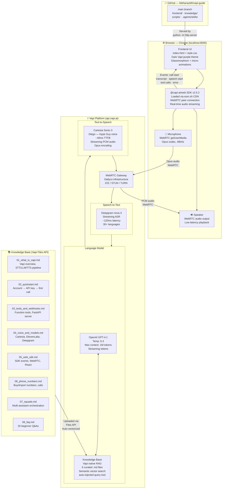
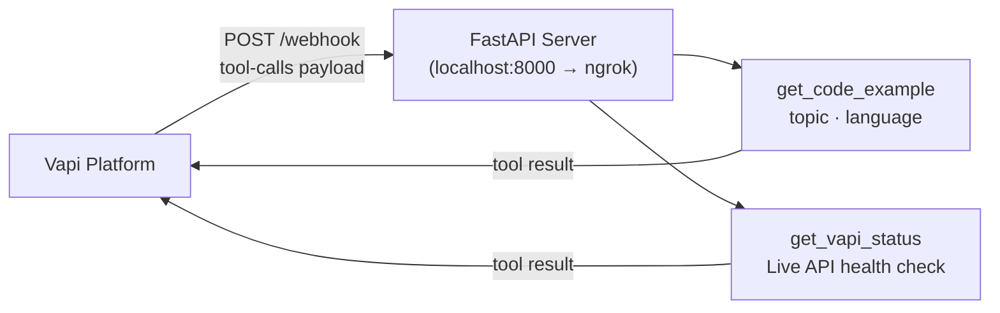

# VapiGuide AI — System Architecture

> *"Vapi, explained by Vapi"* · Hackathon 2026 · Built with Vapi + Cartesia Sonic-3

---

## Architecture Diagram



---

## Component Breakdown

| Layer | Technology | Config | Latency |
|---|---|---|---|
| **Frontend** | HTML + CSS + Vanilla JS | Glassmorphism dark theme, esm.sh SDK | n/a |
| **WebRTC Transport** | Vapi ↔ Daily.co | ICE/STUN/TURN negotiation | ~20ms network |
| **STT** | Deepgram nova-3 | Streaming ASR, language=en | ~120ms |
| **LLM** | OpenAI GPT-4.1 | temp=0.3, streaming | ~200–400ms TTFT |
| **RAG** | Vapi native KB | 6 .md files, semantic query tool | +50ms injected into LLM |
| **TTS** | Cartesia Sonic-3 | Diego voice, streaming PCM | ~40ms TTFB |
| **Total E2E** | — | — | **~400–600ms** |

---

## Data Flow (per turn)

```
1. User speaks       → WebRTC Opus audio → Vapi gateway
2. Vapi gateway      → Deepgram nova-3  → streaming text transcript
3. Transcript event  → Browser SDK      → show user bubble in UI
4. Deepgram final    → GPT-4.1 prompt   → (system prompt + history + KB context)
5. KB tool fires     → semantic search over 6 .md files → injected as context
6. GPT-4.1 streams   → Cartesia Sonic-3 → streaming audio starts at first token
7. Cartesia audio    → WebRTC playback  → user hears Tuttu speak
8. speech-start evt  → Browser SDK      → orb glows teal + breathe animation
9. transcript event  → Browser SDK      → show Tuttu bubble in UI
```

---

## Knowledge Base (RAG) Technical Details

Vapi's native KB uses **semantic vector search**. No external vector database is needed.

| Step | Detail |
|---|---|
| **Ingestion** | Files uploaded via `POST /file` (multipart) |
| **Vectorization** | Vapi auto-chunks and embeds on upload |
| **Retrieval** | Auto-injected `query(input)` function tool |
| **Trigger** | GPT-4.1 calls the tool when context is needed |
| **Response** | Top-k semantically similar chunks injected into LLM context |
| **Files** | 6 × `.md` files (01–08, 2 blocked by Cloudflare during upload) |

---

## Phase 2 — Planned Tool Server



| Tool | Input | Output |
|---|---|---|
| `get_code_example(topic, language)` | e.g. `"create assistant", "python"` | Full boilerplate code snippet |
| `get_vapi_status()` | none | Live Vapi API health JSON |

---

## Security Model

| Key | Exposure | Used Where |
|---|---|---|
| **Public API Key** | Exposed in `app.js` (safe by design) | Browser → Vapi SDK |
| **Private API Key** | In `.env` only (gitignored) | `setup_assistant.py` server-side only |
| **Cartesia Key** | In `.env` only (gitignored) | Phase 2 tool server only |

---

> **Assistant ID:** `95da9243-2a6a-4a02-96e1-0af8ed97d456`  
> **Public Key:** `fb3dac03-f0ee-4b77-8bd6-3f069f5e5774`  
> **Voice:** Cartesia Sonic-3 · Diego (Hype Guy) · `399002e9-7f7d-42d4-a6a8-9b91bd809b9d`  
> **KB Files:** 6 uploaded · assistant ID wired in frontend
